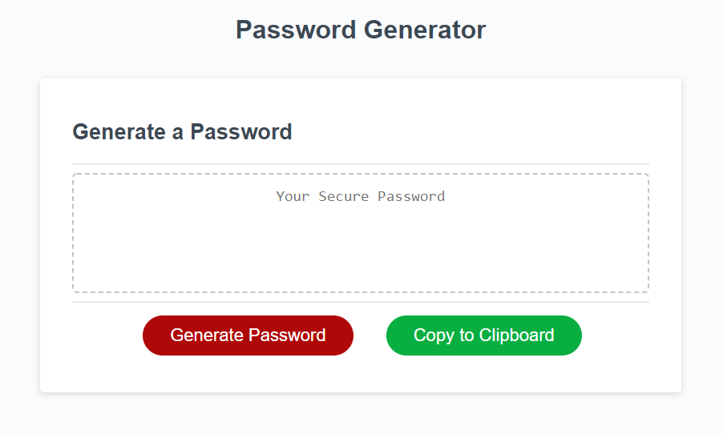

# Password Generator

Password management is one of the most important aspects of application security. This project was developed to help users generate secure passwords based on their input criteria.

## Description

In this repository, I created an interface that allows users to generate their own secure passwords. Based on a series of prompts provided the system will construct the password and output the result in the browser.

This system will enforce some predefined criteria:
- Secure passwords should be at least 8 characters in length
- Use of uppercase, lowercase, numeric, and/or special characters
- If the user does not want to walk through the prompts they can hit cancel on the first screen

## Link to Site

https://codragon2020.github.io/password-generator/

This project was built with HTML, CSS, and JavaScript

## Screenshots

